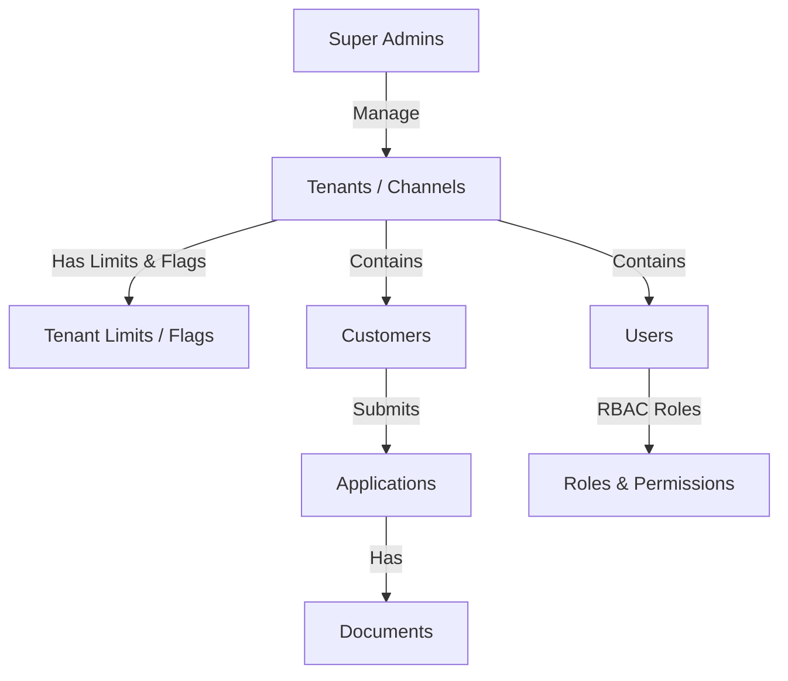

# Enterprise Multi-Tenant Channel Onboarding Platform Database Schema

This repository contains the database migrations and seed files for the **Enterprise Multi-Tenant Channel Onboarding Platform**. The database is designed on PostgreSQL, implementing a highly secure, isolated, and scalable multi-tenant architecture with Row-Level Security (RLS), Role-Based Access Control (RBAC), and robust auditing.

---

## 🏗️ Architecture Overview

The system operates under a dual-architecture model:
1. **Super Admin Plane**: Platform-wide controls, tenant creation, quota allocation, global feature flag settings, and overall system usage caching.
2. **Tenant (Channel) Plane**: Channel-specific operations isolated logically at the database level using PostgreSQL Row-Level Security (RLS).



---

## 📁 Migration Sequence

The migrations must be executed in sequential order. Each file is self-contained with its schema, indexes, constraints, and triggers:

1. **[`000_schema_migrations.sql`](file:///c:/Users/Bharath%20kumar%20reddy/Desktop/DB/000_schema_migrations.sql)**: Tracks applied migration versions.
2. **[`001_create_extensions.sql`](file:///c:/Users/Bharath%20kumar%20reddy/Desktop/DB/001_create_extensions.sql)**: Enables `uuid-ossp` (for UUID v4 keys) and `pgcrypto` (for hashing/salting passwords).
3. **[`002_create_super_admins.sql`](file:///c:/Users/Bharath%20kumar%20reddy/Desktop/DB/002_create_super_admins.sql)**: Defines the platform super administrators (including security, 2FA, contact numbers, and statistics tracking).
4. **[`003_create_super_admin_roles.sql`](file:///c:/Users/Bharath%20kumar%20reddy/Desktop/DB/003_create_super_admin_roles.sql)**: Handles roles mapping for super admins, supporting soft delete (`deleted_at`/`deleted_by`).
5. **[`004_create_super_admin_permissions.sql`](file:///c:/Users/Bharath%20kumar%20reddy/Desktop/DB/004_create_super_admin_permissions.sql)**: Seed-installs Super Admin permissions.
6. **[`005_create_channel.sql`](file:///c:/Users/Bharath%20kumar%20reddy/Desktop/DB/005_create_channel.sql)**: Stores tenant/channel details, white-labeling configurations (custom domains, logos, brand colors), timezones, default currency, and support contacts.
7. **[`006_create_users.sql`](file:///c:/Users/Bharath%20kumar%20reddy/Desktop/DB/006_create_users.sql)**: Stores isolated tenant user credentials with security locking (failed attempts, lockout threshold), password recovery tokens, and 2FA flags (RLS enabled).
8. **[`007_create_channel_roles.sql`](file:///c:/Users/Bharath%20kumar%20reddy/Desktop/DB/007_create_channel_roles.sql)**: Implements tenant-level RBAC roles (`roles`, `user_roles`) and safeguards core role deletion via `is_system_role`.
9. **[`008_create_channel_permissions.sql`](file:///c:/Users/Bharath%20kumar%20reddy/Desktop/DB/008_create_channel_permissions.sql)**: Defines tenant-level RBAC permissions (`permissions`, `role_permissions`).
10. **[`009_create_tenant_limits_flags_routes.sql`](file:///c:/Users/Bharath%20kumar%20reddy/Desktop/DB/009_create_tenant_limits_flags_routes.sql)**: Manages limits (API quotas, storage limits, max users), feature flags (Reports, Notifications toggles), and customized paths catalog per tenant.
11. **[`010_create_customers.sql`](file:///c:/Users/Bharath%20kumar%20reddy/Desktop/DB/010_create_customers.sql)**: Manages customer profiles, demographic details, credit-scoring inputs (income, DOB, occupation), and KYC verification state tracking (RLS enabled).
12. **[`011_create_applications.sql`](file:///c:/Users/Bharath%20kumar%20reddy/Desktop/DB/011_create_applications.sql)**: Tracks customer applications, handling reviewer assignments, approvals, SLAs, and rejection logging (RLS enabled).
13. **[`012_create_documents.sql`](file:///c:/Users/Bharath%20kumar%20reddy/Desktop/DB/012_create_documents.sql)**: Manages uploaded files metadata, tracking document sizes, mime formats, and file verification statuses (RLS enabled).
14. **[`013_create_notifications.sql`](file:///c:/Users/Bharath%20kumar%20reddy/Desktop/DB/013_create_notifications.sql)**: Handles targeted user updates, read receipt timestamps, and notification delivery types (RLS enabled).
15. **[`014_create_job_ledger.sql`](file:///c:/Users/Bharath%20kumar%20reddy/Desktop/DB/014_create_job_ledger.sql)**: Serves as a background job processing log, capturing retry counters, thresholds, and errors.
16. **[`015_create_seed_data.sql`](file:///c:/Users/Bharath%20kumar%20reddy/Desktop/DB/015_create_seed_data.sql)**: Seeds default credentials, system permissions, limits, and customer configurations.

---

## 🔒 Row-Level Security (RLS) Implementation

To ensure strict tenant isolation, RLS is enabled on the following tables:
* `users`
* `customers`
* `applications`
* `documents`
* `notifications`

### How the Isolation Works
Every session querying these tables must set the context variable `app.tenant_id`. The database compares this value to the table's `tenant_id` column:
```sql
CREATE POLICY tenant_isolation_policy ON <table_name>
    FOR ALL
    USING (tenant_id = current_setting('app.tenant_id')::BIGINT)
    WITH CHECK (tenant_id = current_setting('app.tenant_id')::BIGINT);
```

#### Application Example (Setting context within a database transaction):
```sql
BEGIN;
-- Set the tenant context (e.g. for Tenant ID = 1)
SET LOCAL app.tenant_id = '1';

-- All operations here are securely limited to Tenant 1
SELECT * FROM customers;
INSERT INTO applications (customer_id, application_number, application_type, amount) 
VALUES (1, 'APP-9988', 'LOAN', 500000.00);

COMMIT;
```
If a query is run without setting `app.tenant_id`, PostgreSQL will block access or throw a session parameter exception.

---

## 👥 Role-Based Access Control (RBAC)

### Platform Roles (Super Admins)
* **Super Administrator**: Complete read-write platform-wide authority.
* *Permissions included:* `DATABASE_MANAGEMENT`, `PLATFORM_MANAGEMENT`, `LOGS_MANAGEMENT`, `CHANNEL_MANAGEMENT`, `CHANNEL_LIMIT_MANAGEMENT`, `CHANNEL_ROLE_MANAGEMENT`, `USER_MANAGEMENT`, `FEATURE_FLAG_MANAGEMENT`, `AUDIT_LOG_MANAGEMENT`.

### Tenant-Specific Roles
Tenant operations support custom configurations. The system seeds 5 default roles with hierarchical access permissions:
1. **Channel Admin**: Full administrative rights within their tenant channel.
2. **Branch Manager**: Creates customer entries, drafts, and submits applications for their branch.
3. **Reviewer**: Operates in read-only and verification modes to review files and applications.
4. **Operations Executive**: Handles documents verification and validation workflows.
5. **Sales Executive**: Focuses on intake, customer registration, and document uploading.

---

## 🌱 Seed Credentials (Default)

The following defaults are created during the seed migration:

### Super Admin Credentials:
* **Username**: `superadmin`
* **Email**: `superadmin@enterprise.com`
* **Password**: `SuperAdminPassword123!`
* **Salt/Hash method**: Blowfish crypt (10 rounds)

### Sample Tenant (Channel Admin) Credentials:
* **Tenant**: `Default Channel` (ID: `1`)
* **Username**: `channeladmin`
* **Email**: `admin@defaultchannel.com`
* **Password**: `ChannelAdminPassword123!`

---

## ⚡ Setup & Verification

To execute all migrations on your target PostgreSQL instance, you can use the `psql` CLI utility:

```bash
# Execute in sequential order
psql -h <host> -U <user> -d <database> -f 000_schema_migrations.sql
psql -h <host> -U <user> -d <database> -f 001_create_extensions.sql
# ... continue through 014_create_seed_data.sql
```

Alternatively, you can concatenate all files and run them in a single transaction sequence:
```bash
cat 000_schema_migrations.sql 001_create_extensions.sql 002_create_super_admins.sql 003_create_super_admin_roles.sql 004_create_super_admin_permissions.sql 005_create_channel.sql 006_create_users.sql 007_create_channel_roles.sql 008_create_channel_permissions.sql 009_create_tenant_limits_flags_routes.sql 010_create_customers.sql 011_create_applications.sql 012_create_documents.sql 013_create_notifications.sql 014_create_job_ledger.sql 015_create_seed_data.sql > complete_schema.sql

psql -h <host> -U <user> -d <database> -f complete_schema.sql
```
